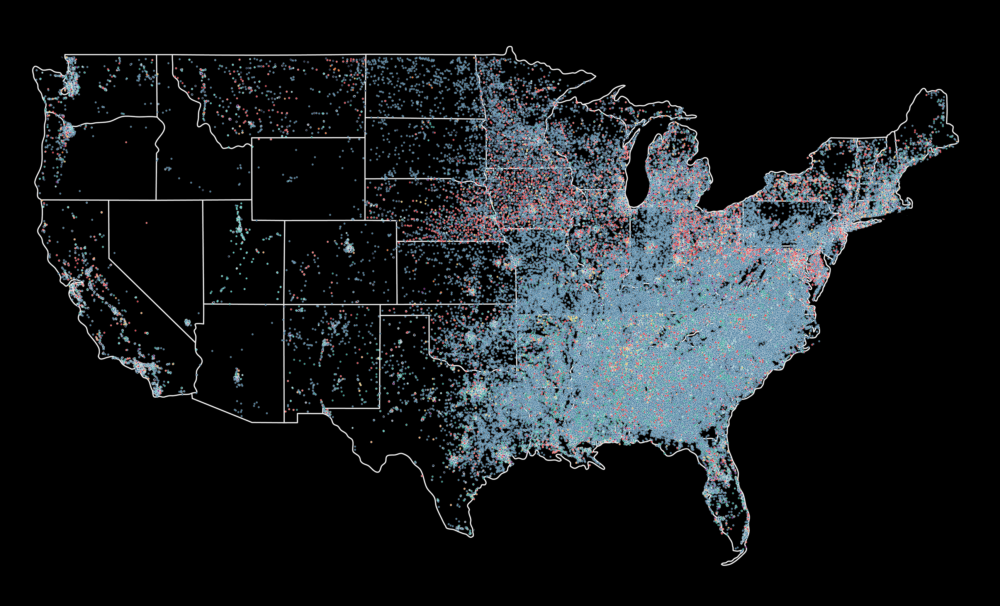

# US Churches: Data Science

### About
- **Goal:** Create a map of the US distribution of churches by denomination
- **Skills:** Web-scraping, dataset manipulation and data visualization
- **Resource:** *Learn to Code with Basketball* by Nathan Braun

### Steps

1. **Web Scraping ([webscraper.py](https://github.com/peytonjpope/ChurchDataScience/blob/main/webscraper.py))**
   - Scraped church data from ExpertGPS for all 48 contiguous US states
   - Extracted church names, latitude, and longitude coordinates from HTML links
   - Used BeautifulSoup and requests libraries to parse web content
   - Implemented denomination classification based on church name keywords

2. **Data Processing ([webscraper.py](https://github.com/peytonjpope/ChurchDataScience/blob/main/webscraper.py))**
   - Combined data from all states into a single DataFrame
   - Cleaned and converted coordinate data to float format
   - Categorized churches into 11 denominations
   - Exported final dataset to ([churches.csv](https://github.com/peytonjpope/ChurchDataScience/blob/main/churches.csv))**

3. **Data Visualization ([graphs.py](https://github.com/peytonjpope/ChurchDataScience/blob/main/graphs.py))**
   - Created scatter plots showing geographic distribution of all churches and by denomination
   - Generated density contour maps to visualize concentration patterns
   - Used custom color palette for denomination differentiation
   - Produced both aggregate and denomination-specific visualizations

## Results
### Scatter Plot Visualizations  

  
*All churches*  

---

  
*Baptist churches*  

---

  
*Methodist churches*  

---

  
*Presbyterian churches*  

---

  
*Episcopal churches*  

---

  
*Catholic churches*  

---

  
*Latter-Day Saints churches*  

---

  
*Lutheran churches*  

---

  
*Mennonite churches*  

---

  
*Pentecostal churches*  

---

### Density Map Visualizations  

  
*All churches density*  

---

  
*Baptist churches density*  

---

  
*Methodist churches density*  

---

  
*Presbyterian churches density*  

---

  
*Episcopal churches density*  

---

  
*Catholic churches density*  

---

  
*Latter-Day Saints churches density*  

---

  
*Lutheran churches density*  

---

  
*Mennonite churches density*  

---

  
*Pentecostal churches density*  

---
